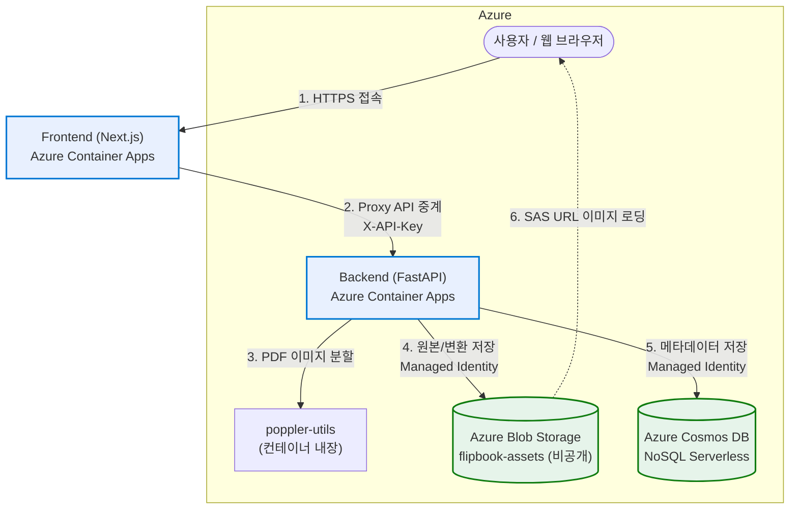

# 📖 JJFlipBook — PDF 플립북 뷰어 서비스 (Azure Edition)

PDF 문서를 업로드하여 웹 브라우저에서 실제 책을 넘기는 듯한 **3D 플립북(Page Flip)** 형태로 감상할 수 있는 애플리케이션입니다.

> 이 저장소는 [jjflipbook_test_001](https://github.com/freeman9844/jjflipbook_test_001)(GCP 기반)을
> **Microsoft Azure**로 마이그레이션한 버전입니다.

## 주요 기능

- **3D 플립북 뷰어**: `react-pageflip` 기반 실제 책장 넘김 효과, 모바일 동적 스케일링(`100dvh`) 지원
- **오버레이 에디터**: 페이지 위에 링크/영상 영역을 지정하는 에디터 (`/edit/[bookId]`)
- **1-Level 폴더 시스템**: 폴더 단위 문서 관리 + **연쇄 삭제(Cascade Delete)** — 폴더 삭제 시 하위 플립북 메타데이터(Cosmos), 오버레이, Blob 실물 파일까지 고아 데이터 없이 일괄 정리
- **원본 PDF 보존/다운로드**: 페이지 이미지와 함께 원본 `.pdf`도 Blob에 보존, 뷰어에서 다이렉트 다운로드
- **배경음악(BGM) 플레이어**: Blob `bgm/` 경로의 MP3를 동적으로 스캔해 플레이리스트 구성 — 재배포 없이 파일 추가/삭제만으로 갱신. 모바일 자동재생 정책은 첫 터치(`pointerdown`) 시 재생 락 해제로 우회
- **관리자 인증**: bcrypt 해싱 + `HttpOnly` 세션 쿠키 + 내부 API 키(`INTERNAL_API_KEY`) 이중 검증. `/view/*`만 공개, 나머지는 `AuthGuard`로 보호

## 아키텍처

| 계층 | 기술 스택 |
| --- | --- |
| **Frontend** | Next.js (standalone), react-pageflip — **Azure Container Apps** |
| **Backend** | FastAPI (Python 3.11), poppler-utils, pdf2image — **Azure Container Apps** |
| **Database** | **Azure Cosmos DB for NoSQL** (Serverless) — `users` / `folders` / `flipbooks` / `overlays` |
| **Storage** | **Azure Blob Storage** 프라이빗 컨테이너 `flipbook-assets` (페이지 이미지 · PDF · `bgm/` MP3) — SAS URL로 접근 |
| **Registry / 배포** | **ACR + azd (Azure Developer CLI) + Bicep** 원클릭 |
| **인증(서비스 간)** | Managed Identity (Cosmos Data Contributor, Storage Blob Data Contributor) |

- 컨테이너 양쪽 모두 `minReplicas: 0` — **스케일 투 제로**로 유휴 비용 최소화
- 백엔드는 PDF 변환 OOM 방지를 위해 동시 요청 1개로 스케일 (`concurrentRequests: 1`)
- Cosmos DB Serverless + Blob LRS — 사용량 기반 과금

### 배포 구조도



### GCP → Azure 매핑

| GCP (원본) | Azure (이 저장소) |
| --- | --- |
| Cloud Run | Azure Container Apps |
| Firestore (`overlays` 서브컬렉션) | Cosmos DB for NoSQL — `overlays`는 `/bookId` 파티션의 독립 컨테이너로 평탄화 |
| Cloud Storage 공개 버킷 | Blob Storage **비공개** 컨테이너 + **User-Delegation SAS URL** |
| Artifact Registry + Cloud Build | ACR + `remoteBuild: true` (로컬 Docker 불필요) |
| ADC(서비스 계정) | User-Assigned **Managed Identity** + `DefaultAzureCredential` |
| `deploy.sh` 원클릭 스크립트 | `azd up` (Bicep IaC) |


## 🚀 원클릭 배포 (azd)

사전 준비: [azd 설치](https://aka.ms/azd), `az login`

```bash
azd auth login
azd init   # 기존 환경이 없다면 환경 이름/구독/리전 선택

# 보안 시크릿 3종 설정 (미설정 시 프로비저닝 실패)
azd env set ADMIN_PASSWORD '<관리자 비밀번호>'
azd env set INTERNAL_API_KEY '<내부 API 키>'
azd env set SESSION_SECRET '<세션 서명 키>'

azd up     # 인프라 프로비저닝 + 빌드 + 배포
```

`azd up` 완료 후 출력되는 `FRONTEND_URL`로 접속합니다. (최초 관리자 계정: `admin` / 설정한 `ADMIN_PASSWORD`)

### 환경 변수

| 변수 | 주입 대상 | 설명 |
| --- | --- | --- |
| `COSMOS_ENDPOINT` / `COSMOS_DB_NAME` | Backend | Cosmos DB 엔드포인트 / DB 이름(`jjflipbook`) |
| `STORAGE_ACCOUNT_NAME` / `BLOB_CONTAINER_NAME` | Backend | Blob 계정 / 컨테이너(`flipbook-assets`) |
| `NEXT_PUBLIC_BACKEND_URL` | Frontend (빌드 ARG) | 백엔드 엔드포인트 (정적 JS에 반영) |
| `INTERNAL_API_KEY` | Backend + Frontend | FE → BE 내부 API 인증 키 (양쪽 동일) |
| `ADMIN_PASSWORD` | Backend | 초기 관리자 계정 시딩 비밀번호 |
| `SESSION_SECRET` | Frontend | 로그인 세션 쿠키(`auth_token`) 서명 키 |
| `FRONTEND_URL` | Backend | CORS 허용 도메인 (Bicep이 자동 계산) |

## 로컬 개발

로컬에서 Cosmos/Blob 연동에는 `az login` 토큰이 사용됩니다 (`DefaultAzureCredential`).
배포된 리소스의 값으로 `COSMOS_ENDPOINT`, `STORAGE_ACCOUNT_NAME` 환경변수를 설정하세요.

```bash
# Backend (기본 8000 포트)
cd backend
python3 -m venv venv && source venv/bin/activate
pip install -r requirements.txt
uvicorn main:app --reload --host 0.0.0.0 --port 8000

# Frontend (기본 3000 포트)
cd frontend
npm install --legacy-peer-deps
npm run dev
```

## 테스트

```bash
# Backend 오프라인 단위 테스트 (Azure 연결 불필요 — mock 기반)
cd backend && ./venv/bin/python -m pytest tests/ -v

# Frontend 단위 테스트
cd frontend && npx jest
```

## 📂 디렉토리 구조

```text
├── azure.yaml                     # azd 서비스 정의 (remoteBuild: ACR 원격 빌드)
├── infra/
│   ├── main.bicep                 # 구독 스코프 진입점 (RG + 태그)
│   ├── resources.bicep            # ACA/Cosmos/Blob/ACR/MI/역할 할당 전체
│   └── main.parameters.json       # azd env 파라미터 바인딩
├── backend/
│   ├── main.py                    # FastAPI 진입점 (GZip, CORS, admin 시딩)
│   ├── database.py                # Cosmos/Blob lazy singleton + SAS 발급 (get_container / get_blob_container / sign_url)
│   ├── models.py                  # Pydantic 데이터 모델
│   ├── utils.py                   # 비밀번호 해싱, API 키 검증
│   ├── pdf_utils.py               # poppler 기반 PDF 렌더링 (5장 청크 처리)
│   ├── routers/                   # auth / flipbooks / folders / music API
│   ├── services/flipbook_service.py  # PDF 변환 업로드 + 연쇄 삭제 핵심 로직
│   ├── scripts/cleanup_test_data.py  # 테스트 더미 데이터 정화 스크립트
│   └── tests/                     # 오프라인 단위 테스트 (Azure mock)
└── frontend/
    ├── src/app/
    │   ├── page.tsx               # 대시보드 (폴더/플립북 관리)
    │   ├── view/[uuidKey]/        # 3D 플립북 뷰어
    │   ├── edit/[bookId]/         # 오버레이 에디터
    │   └── api/
    │       ├── backend/           # 백엔드 통합 프록시 (인증 헤더 주입)
    │       └── music/             # BGM 목록 API (백엔드 /music/list 프록시)
    └── src/components/            # AuthGuard, FlipbookCard, MusicPlayer 등
```

## ⚡ 성능 · 안정성 최적화

원본(GCP)에서 검증된 최적화가 Azure 버전에도 그대로 유지됩니다.

### 대용량 PDF 처리 (OOM 방지)
- **청크 단위 변환**: PDF 전체를 메모리에 올리지 않고 **5페이지 청크**로 순차 디코딩 (`pdf_utils.py`), `thread_count=os.cpu_count()`로 vCPU에 맞춰 병렬화
- **스트리밍 프록시**: Next.js 프록시가 업로드 바디를 버퍼링 없이 파이프 (`duplex: 'half'`)
- **병렬 Blob 업로드**: `ThreadPoolExecutor`(5 workers)로 페이지 이미지 동시 업로드
- **자원 회수 보장**: 성공/실패와 무관하게 `finally`에서 임시 디렉토리 강제 소거
- **변환 품질 파라미터화**: `PDF_DPI`(기본 150), `WEBP_QUALITY`(기본 75) 환경변수로 조정 가능

### Cold Start 최적화 (scale-to-zero 유지)
- **Lazy Azure 클라이언트**: `database.py`의 Cosmos/Blob 클라이언트는 첫 호출 시점에 초기화 — 모듈 임포트 시 인증 비용 없음
- **Multi-stage Docker**: builder/runtime 이미지 분리로 이미지 경량화
- **Startup 경량화**: admin 시딩은 `asyncio.create_task` 백그라운드 실행, 헬스체크(`/`)는 외부 호출 없음
- **Lazy import**: `pdf2image`는 실제 변환 시점에만 임포트

### API 응답 최적화
- **GZip 압축**: 1KB 이상 응답 자동 압축 (`GZipMiddleware`)
- **쿼리 제한**: `GET /flipbooks`는 `ORDER BY created_at DESC` + 최신 50건 제한 (무제한 스캔 방지)
- **SAS 캐싱**: User-Delegation SAS는 2시간 유효 토큰을 캐시하고 만료 10분 전 자동 갱신 — 요청마다 발급하지 않음

## 💰 비용 최적화 (Zero-Waste)

| 서비스 | 설정 | 값 | 근거 |
| --- | --- | --- | --- |
| Backend | `minReplicas` | `0` | 트래픽 없을 때 스케일 투 제로 |
| Backend | `maxReplicas` | `2` | 동시 PDF 변환 상한, 폭주 요금 방지 |
| Backend | `concurrentRequests` | `1` | 레플리카당 PDF 변환 1건 (OOM 방지) |
| Backend | 리소스 | `2Gi / 1vCPU` | PDF 변환 최소 사양 |
| Frontend | `minReplicas` / `maxReplicas` | `0` / `2` | 스케일 투 제로 + 상한 |
| Frontend | 리소스 | `1Gi / 0.5vCPU` | Next.js standalone + sharp OOM 방지 |
| Cosmos DB | Serverless | — | 요청 단위 과금, 유휴 시 스토리지 비용만 |
| Blob Storage | Standard LRS | — | 사용량 기반 과금 |

## 🔒 보안 설계

- **프록시 릴레이**: 브라우저는 백엔드를 직접 호출하지 않고 Next.js `/api/backend/*` 프록시를 경유 — 쓰기 작업(업로드/삭제/오버레이 저장)은 프록시가 주입하는 `INTERNAL_API_KEY`(`X-API-Key`)를 백엔드가 재검증
- **CORS 화이트리스트**: 백엔드는 Bicep이 계산한 `FRONTEND_URL` 단일 도메인만 허용
- **비공개 Blob + SAS**: 컨테이너는 `publicAccess: None`. 모든 에셋 접근은 백엔드가 Managed Identity로 발급하는 **읽기 전용 User-Delegation SAS URL**(2시간 유효)로만 가능 — 계정 키를 코드/환경변수 어디에도 두지 않음
- **Managed Identity 최소 권한**: Cosmos DB Built-in Data Contributor + Storage Blob Data Contributor를 해당 리소스 스코프로만 부여
- **시크릿 관리**: `ADMIN_PASSWORD` / `INTERNAL_API_KEY` / `SESSION_SECRET`은 `azd env set` → Bicep `@secure()` 파라미터 → Container Apps secret으로 주입. 저장소에 하드코딩 없음
- **패스워드 암호화**: bcrypt 해싱, `HttpOnly` 쿠키로 XSS 세션 탈취 차단

## 📱 모바일 UX

- **동적 뷰포트 스케일링**: `100dvh` + 상단 기준 스케일 다운으로 좁은 화면에서도 책과 UI 동시 노출
- **Android 깜빡임 수정**: `is-android` 클래스 스코프로 GPU 이중 합성 충돌 제거
- **iOS 터치 대응**: `mobileScrollSupport`, 직접 크기 계산(props), `touch-action: manipulation` 적용
- **BGM 자동재생 우회**: 첫 `pointerdown`에서 오디오 재생 락 해제

## 알려진 제약

### 테넌트 정책 관련 참고

일부 테넌트(예: MCAPS Demo)에서는 관리 그룹 정책이 Cosmos DB의 `publicNetworkAccess`를 강제로 비활성화하거나
Blob 컨테이너의 공개 접근을 차단할 수 있습니다. 이 저장소의 Bicep은 다음 두 가지 방식으로 이를 처리합니다:

- **리소스 그룹 태그 `SecurityControl: Ignore`** — MCAPS 정책 예외 태그를 RG에 설정하여
  `azd up` 후 Cosmos의 공개 네트워크 접근이 유지됩니다.
- **SAS URL 기반 Blob 접근** — Blob 컨테이너는 의도적으로 비공개(`publicAccess: None`)이며,
  모든 이미지·PDF·BGM 접근은 백엔드가 발급하는 User-Delegation SAS URL을 통해 이루어집니다
  (컨테이너 공개 접근 불필요).

또한 `azure.yaml`의 `remoteBuild: true` 설정 덕분에 **로컬 Docker 설치 없이** ACR이 빌드를 대신 수행합니다.

- **긴 PDF 변환**: 업로드 요청이 변환을 동기 대기합니다. Container Apps ingress의
  요청 타임아웃(약 240초)을 초과하는 대형 PDF는 클라이언트에서 타임아웃될 수 있습니다.
  (Cosmos에는 `processing` 상태로 남으며, 변환은 서버에서 계속 진행됩니다.)
- **BGM 목록**: `flipbook-assets` 컨테이너의 `bgm/` 경로에 MP3를 업로드하면
  뮤직 플레이어 목록에 자동 노출됩니다. 백엔드 `/music/list` 엔드포인트가 user-delegation SAS URL을 생성하여 반환합니다 (컨테이너 공개 접근 불필요).
- GCP 시절 설계/플랜 문서는 `docs/` 아래에 참고용으로 보존되어 있습니다.
