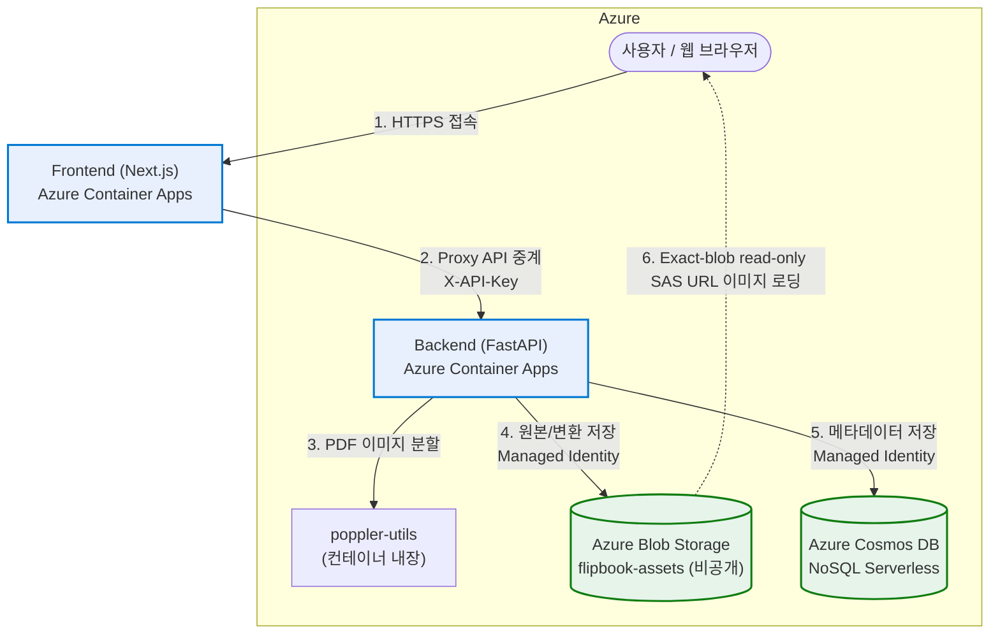

# 📖 JJFlipBook — PDF 플립북 뷰어 서비스 (Azure Edition)

PDF 문서를 업로드하여 웹 브라우저에서 실제 책을 넘기는 듯한 **3D 플립북(Page Flip)** 형태로 감상할 수 있는 애플리케이션입니다.

> 이 저장소는 [jjflipbook_test_001](https://github.com/freeman9844/jjflipbook_test_001)(GCP 기반)을
> **Microsoft Azure**로 마이그레이션한 버전입니다.

## 주요 기능

- **3D 플립북 뷰어**: `react-pageflip` 기반 실제 책장 넘김 효과, 모바일 동적 스케일링(`100dvh`) 지원
- **오버레이 에디터**: 페이지 위에 링크/영상 영역을 지정하는 에디터 (`/edit/[bookId]`)
- **1-Level 폴더 시스템**: 폴더 단위 문서 관리 + **연쇄 삭제(Cascade Delete)** — 폴더 삭제 시 하위 Blob 실물 파일 정리를 먼저 끝낸 뒤 Cosmos 플립북/오버레이 메타데이터를 제거하며, 중간 실패 시 메타데이터를 남겨 재시도 가능
- **원본 PDF 보존/다운로드**: 페이지 이미지와 함께 원본 `.pdf`도 Blob에 보존, 뷰어에서 다이렉트 다운로드
- **배경음악(BGM) 플레이어**: Blob `bgm/` 경로의 MP3를 동적으로 스캔해 플레이리스트 구성 — 재배포 없이 파일 추가/삭제만으로 갱신. 모바일 자동재생 정책은 첫 터치(`pointerdown`) 시 재생 락 해제로 우회
- **관리자 인증**: bcrypt 해싱 + **HMAC-SHA256 서명된 8시간 `HttpOnly` 세션 쿠키** + 내부 API 키(`INTERNAL_API_KEY`) 이중 검증. `/view/*`만 공개, 나머지는 `AuthGuard`로 보호

## 아키텍처

| 계층 | 기술 스택 |
| --- | --- |
| **Frontend** | Next.js (standalone), react-pageflip — **Azure Container Apps** |
| **Backend** | FastAPI (Python 3.11), poppler-utils, pdf2image — **Azure Container Apps** |
| **Database** | **Azure Cosmos DB for NoSQL** (Serverless) — `users` / `folders` / `flipbooks` / `overlays` |
| **Storage** | **Azure Blob Storage** 프라이빗 컨테이너 `flipbook-assets` (페이지 이미지 · PDF · `bgm/` MP3) — **정확한 Blob 단위 읽기 전용 User-Delegation SAS URL**로 접근 |
| **Registry / 배포** | **GHCR (GitHub Container Registry) + azd (Azure Developer CLI) + Bicep** 원클릭 |
| **Identity / Access** | User-Assigned Managed Identity — **Backend:** Cosmos DB Built-in Data Contributor + Storage Blob Data Contributor (ACR Pull ID 불필요) |

- **24시간 Always-Warm 로그인 경로**: Frontend와 Backend 모두 `minReplicas: 1`로 유지해 로그인 화면과 `/login` API의 Container Apps 콜드 스타트를 제거합니다. 기존 KEDA cron 규칙 `daily-warm-window`는 상시 최소 레플리카와 중복되므로 제거했습니다.
- **Frontend**: HTTP 동시 요청 10개를 기준으로 `1`개에서 최대 `2`개까지 확장합니다. (0.25 vCPU / 0.5 GiB)
- **Backend**: HTTP 동시 요청 1개를 기준으로 `1`개에서 최대 `2`개까지 확장해 레플리카당 PDF 변환을 1건으로 제한합니다. (1 vCPU / 2 GiB)
- Cosmos DB Serverless + Blob LRS — 사용량 기반 과금

### 배포 구조도



### GCP → Azure 매핑

| GCP (원본) | Azure (이 저장소) |
| --- | --- |
| Cloud Run | Azure Container Apps |
| Firestore (`overlays` 서브컬렉션) | Cosmos DB for NoSQL — `overlays`는 `/bookId` 파티션의 독립 컨테이너로 평탄화 |
| Cloud Storage 공개 버킷 | Blob Storage **비공개** 컨테이너 + **exact-blob read-only User-Delegation SAS URL** |
| Artifact Registry + Cloud Build | GHCR (GitHub Container Registry)을 활용한 GitHub Actions 자동화 빌드 (기존 ACR 원격 빌드는 제거되어 `AZURE_CONTAINER_REGISTRY_ENDPOINT` 및 ACR 리소스는 사용하지 않음) |
| ADC(서비스 계정) | User-Assigned **Managed Identity** + `DefaultAzureCredential` |
| `deploy.sh` 원클릭 스크립트 | `azd provision` (Bicep IaC) |


## 🚀 원클릭 배포 (azd)

사전 준비: [azd 설치](https://aka.ms/azd), `az login`

이 프로젝트는 GitHub Actions CI/CD를 통해 이미지가 빌드되어 **GHCR (GitHub Container Registry)**에 공개 패키지로 퍼블리시됩니다. 배포 시 Azure Container Registry(ACR)나 원격 빌드가 필요하지 않고, 배포 파이프라인에서 빌드된 불변(Immutable) 이미지를 바로 사용합니다.

```bash
azd auth login
azd init   # 기존 환경이 없다면 환경 이름/구독/리전 선택

# 보안 시크릿 3종 설정 (미설정 시 프로비저닝 실패)
azd env set ADMIN_PASSWORD '<관리자 비밀번호>'
azd env set INTERNAL_API_KEY '<내부 API 키>'
azd env set SESSION_SECRET '<세션 서명 키>'

# 배포할 불변 GHCR 이미지 지정
azd env set BACKEND_IMAGE 'ghcr.io/freeman9844/jjflipbook-azure-backend:<commit-sha>'
azd env set FRONTEND_IMAGE 'ghcr.io/freeman9844/jjflipbook-azure-frontend:<commit-sha>'

azd provision     # 인프라 프로비저닝 및 GHCR 이미지 기반 배포 수행
```

일반 운영 배포에는 이미지 빌드부터 smoke test까지 포함하는 GitHub Actions 사용을 권장합니다.
로컬 `azd provision`은 이미 GHCR에 게시된 Backend/Frontend commit-SHA 이미지가 있을 때 사용합니다.

`azd provision` 완료 후 출력되는 `FRONTEND_URL`로 접속합니다. (관리자 계정: `admin` / 설정한 `ADMIN_PASSWORD`)
이번 보안 하드닝 배포 이후에는 기존 로그인 세션이 모두 무효화되므로 다시 로그인해야 합니다.

### GHCR 최초 마이그레이션 주의사항 (Public Gate)
최초 GHCR 배포 또는 마이그레이션 시, GHCR 패키지 풀(Anonymous Pull) 권한 제약으로 인해 배포가 한 번 실패할 수 있습니다. 이 경우, GitHub의 해당 저장소 Packages 탭에서 생성된 **프론트엔드 및 백엔드 패키지의 가시성을 'Public(공개)'으로 직접 전환**한 다음 배포 파이프라인을 재실행(Rerun)해야 무중단으로 익명 풀이 정상 완료됩니다.

### 환경 변수

| 변수 | 주입 대상 | 설명 |
| --- | --- | --- |
| `COSMOS_ENDPOINT` / `COSMOS_DB_NAME` | Backend | Cosmos DB 엔드포인트 / DB 이름(`jjflipbook`) |
| `STORAGE_ACCOUNT_NAME` / `BLOB_CONTAINER_NAME` | Backend | Blob 계정 / 컨테이너(`flipbook-assets`) |
| `NEXT_PUBLIC_BACKEND_URL` | Frontend (런타임) | Container Apps 환경 내부의 백엔드 URL. 브라우저 번들이 아니라 Next.js 서버 프록시와 뮤직 API가 요청 시 읽음 |
| `INTERNAL_API_KEY` | Backend + Frontend | FE → BE 내부 API 인증 키 (양쪽 동일) |
| `ADMIN_PASSWORD` | Backend | 관리자 비밀번호의 기준값. 시작 시 admin 문서가 없으면 생성하고 기존 해시와 다르면 안전하게 동기화 |
| `SESSION_SECRET` | Frontend | HMAC-SHA256 기반 8시간 `auth_token` 세션 서명 키 (production에서는 32자 이상 필수) |
| `FRONTEND_URL` | Backend | CORS 허용 도메인 (Bicep이 자동 계산) |

## 로컬 개발

로컬에서 Cosmos/Blob 연동에는 `az login` 토큰이 사용됩니다 (`DefaultAzureCredential`).
배포된 리소스의 값으로 `COSMOS_ENDPOINT`, `STORAGE_ACCOUNT_NAME` 환경변수를 설정하세요.

```bash
# Backend (기본 8000 포트)
cd backend
python3 -m venv venv && source venv/bin/activate
pip install -r requirements-dev.txt
uvicorn main:app --reload --host 0.0.0.0 --port 8000

# Frontend (기본 3000 포트)
cd frontend
npm install --legacy-peer-deps
npm run dev
```

## 테스트

```bash
# Backend 오프라인 단위 테스트 (Azure 연결 불필요 — mock 기반)
cd backend && ./venv/bin/python -m pytest tests/ -v

# Frontend 단위 테스트
cd frontend && npx jest
```

## 📂 디렉토리 구조

```text
├── azure.yaml                     # azd 서비스 정의 (GHCR 기반 이미지 지정)
├── .github/workflows/
│   └── azure-dev.yml              # GHCR 빌드, OIDC 인증, preview, 배포, smoke test
├── infra/
│   ├── main.bicep                 # 구독 스코프 진입점 (RG + 태그)
│   ├── resources.bicep            # ACA/Cosmos/Blob/MI/역할 할당 전체
│   └── main.parameters.json       # azd env 파라미터 바인딩
├── backend/
│   ├── main.py                    # FastAPI 진입점 (GZip, CORS, admin 시딩)
│   ├── database.py                # Cosmos/Blob lazy singleton + exact-blob read-only SAS 발급 (get_container / get_blob_container / sign_url)
│   ├── models.py                  # Pydantic 데이터 모델
│   ├── utils.py                   # 비밀번호 해싱, API 키 검증
│   ├── pdf_utils.py               # poppler 기반 PDF 렌더링 (5장 청크 처리)
│   ├── routers/                   # auth / flipbooks / folders / music API
│   ├── services/flipbook_service.py  # PDF 변환 업로드 + 연쇄 삭제 핵심 로직
│   ├── scripts/cleanup_test_data.py  # 테스트 더미 데이터 정화 스크립트
│   └── tests/                     # 오프라인 단위 테스트 (Azure mock)
├── scripts/
│   ├── wait_for_revision_convergence.sh  # 정확한 SHA 이미지의 Healthy 리비전 전환 대기
│   ├── smoke_test_deployment.sh           # 로그인·목록·업로드·조회·삭제 종단 간 검증
│   ├── cleanup_legacy_azure_resources.sh  # smoke 성공 증명 후 레거시 리소스 정리
│   └── cleanup_ghcr_versions.py           # 운영/롤백 이미지 보호 후 GHCR 버전 정리
└── frontend/
    ├── src/app/
    │   ├── page.tsx               # 대시보드 (폴더/플립북 관리)
    │   ├── view/[uuidKey]/        # 3D 플립북 뷰어
    │   ├── edit/[bookId]/         # 오버레이 에디터
    │   └── api/
    │       ├── backend/           # 백엔드 통합 프록시 (인증 헤더 주입)
    │       └── music/             # BGM 목록 API (백엔드 /music/list 프록시)
    └── src/components/            # AuthGuard, FlipbookCard, MusicPlayer 등
```

## ⚡ 성능 · 안정성 최적화

원본(GCP)에서 검증된 최적화가 Azure 버전에도 그대로 유지됩니다.

### 대용량 PDF 처리 (OOM 방지)
- **청크 단위 변환**: PDF 전체를 메모리에 올리지 않고 **5페이지 청크**로 순차 디코딩 (`pdf_utils.py`), `thread_count=os.cpu_count()`로 vCPU에 맞춰 병렬화
- **스트리밍 프록시**: Next.js 프록시가 업로드 바디를 버퍼링 없이 파이프 (`duplex: 'half'`)
- **병렬 Blob 업로드**: `ThreadPoolExecutor`(5 workers)로 페이지 이미지 동시 업로드
- **자원 회수 보장**: 성공/실패와 무관하게 `finally`에서 임시 디렉토리 강제 소거
- **변환 품질 파라미터화**: `PDF_DPI`(기본 150), `WEBP_QUALITY`(기본 75) 환경변수로 조정 가능
- **표지 사전 생성**: 첫 페이지에서 384px·640px WebP 표지를 생성해 브라우저가 `srcset`으로 선택 — 런타임 이미지 재변환과 Sharp 의존성 제거

### Cold Start 및 리소스 구성 최적화
- **Frontend/Backend 상시 최소 1개**: 로그인 요청의 전체 동기 경로인 `Frontend → Backend /login → Cosmos DB`에서 Container Apps 기동 대기를 제거합니다.
- **HTTP 자동 확장 유지**: 두 앱 모두 `maxReplicas: 2`와 기존 HTTP 스케일 규칙을 유지하므로 트래픽 증가 시 2개까지 확장되고, 유휴 시에는 1개로 축소됩니다.
- **Cron 워밍 제거**: `daily-warm-window` KEDA cron 규칙은 `minReplicas: 1`과 기능이 중복되어 사용하지 않습니다.
- **Lazy Azure 클라이언트**: `database.py`의 Cosmos/Blob 클라이언트는 첫 호출 시점에 초기화 — 모듈 임포트 시 인증 비용 없음
- **Multi-stage Docker**: builder/runtime 이미지 분리로 이미지 경량화
- **Startup 경량화**: admin 생성·비밀번호 동기화는 `asyncio.create_task` 백그라운드 실행, 헬스체크(`/healthz`)는 외부 호출 없음
- **Lazy import**: `pdf2image`는 실제 변환 시점에만 임포트
- **Frontend 리소스**: 0.25 vCPU / 0.5 GiB로 가볍고 슬림한 Next.js standalone 호스팅 보장
- **Backend 리소스**: 1 vCPU / 2 GiB 할당으로 넉넉한 CPU 및 메모리 대역폭을 통한 대용량 PDF 변환 최적성 보장

### API 응답 및 로깅 최적화
- **GZip 압축**: 1KB 이상 응답 자동 압축 (`GZipMiddleware`)
- **쿼리 제한**: `GET /flipbooks`는 `ORDER BY created_at DESC` + 최신 50건 제한 (무제한 스캔 방지)
- **Delegation Key 캐싱**: 8시간 User-Delegation Key를 캐시하고 여유 시간을 두고 재발급 — 각 응답에서는 요청된 개별 Blob에 대해서만 읽기 전용 SAS(2시간 유효)를 새로 서명
- **로깅 소음 최소화**: Uvicorn 내부의 verbose한 access 로그 출력을 프로덕션 환경에서 비활성화하여 리소스와 I/O 낭비를 막고, 그 대신 **Azure Application Insights의 요청 텔레메트리** 및 **Azure Container Apps(ACA) 시스템 로그**만을 살려 두어 고차원 관측성과 모니터링을 효율적으로 영속합니다.

## 💰 비용 · 응답성 균형

| 서비스 | 설정 | 값 | 근거 |
| --- | --- | --- | --- |
| Backend | `minReplicas` / `maxReplicas` | `1` / `2` | 로그인·PDF API 콜드 스타트 제거, 동시 PDF 변환 상한 유지 |
| Backend | `concurrentRequests` | `1` | 레플리카당 PDF 변환 1건 (OOM 방지) |
| Backend | KEDA cron | 없음 | 상시 최소 1개 유지와 중복되는 `daily-warm-window` 제거 |
| Backend | 리소스 | `1vCPU / 2GiB` | PDF 변환 성능 보장 및 변환 시간 단축 |
| Frontend | `minReplicas` / `maxReplicas` | `1` / `2` | 24시간 빠른 첫 화면과 로그인 프록시 응답 |
| Frontend | KEDA cron | 없음 | 상시 최소 1개 유지와 중복되는 `daily-warm-window` 제거 |
| Frontend | 리소스 | `0.25vCPU / 0.5GiB` | Next.js standalone 최적 사양 |
| Cosmos DB | Serverless | — | 요청 단위 과금, 유휴 시 스토리지 비용만 |
| Blob Storage | Standard LRS | — | 사용량 기반 과금 |

이 설정은 Scale-to-Zero 비용 절감보다 **24시간 로그인 응답성**을 우선합니다. 기존 KST Warm Window 대비 단순 idle 증분 추정은 Frontend 약 `USD 3.36/월`, Backend 약 `USD 13.45/월`, 합계 약 `USD 16.81/월`이며, Azure 무료 제공량·실제 active 사용량·세금은 제외한 참고값입니다.

## 🔒 보안 설계

- **백엔드 Internal Ingress**: 백엔드는 `external: false`로 Container Apps 환경 내부에서만 접근 가능 — 공용 인터넷에서 백엔드 API 직접 호출이 원천 차단됨
- **프록시 릴레이**: 브라우저는 백엔드를 직접 호출하지 않고 Next.js `/api/backend/*` 프록시를 경유 — 쓰기 작업(업로드/삭제/오버레이 저장)은 프록시가 주입하는 `INTERNAL_API_KEY`(`X-API-Key`)를 백엔드가 재검증
- **CORS 화이트리스트**: 백엔드는 Bicep이 계산한 `FRONTEND_URL` 단일 도메인만 허용
- **비공개 Blob + exact-blob SAS**: 컨테이너는 `publicAccess: None`. 공개 뷰어는 Blob 컨테이너를 목록 조회할 수 없고, 모든 에셋 접근은 백엔드가 Managed Identity로 발급하는 **정확한 Blob 단위 읽기 전용 User-Delegation SAS URL**(2시간 유효)로만 가능 — 계정 키 접근 자체가 비활성화됨(`allowSharedKeyAccess: false`)
- **Defender for Storage 미적용**: 과도한 고정 비용을 발생시키는 클라우드 수준의 Defender for Storage를 **이 애플리케이션의 Storage Account에 한해서만 명시적으로 비활성화**하여 최적의 저비용 구조를 실현했습니다.
- **Cosmos AAD 전용 인증**: `disableLocalAuth: true`로 키 기반 접근 차단, Managed Identity(AAD)만 허용
- **Blob Soft Delete(7일)**: 실수로 삭제된 Blob 복구 안전망
- **Managed Identity 최소 권한**: Backend 전용 User-Assigned Managed Identity에 Cosmos DB Built-in Data Contributor와 Storage Blob Data Contributor만 부여합니다. Frontend에는 Azure Managed Identity를 연결하지 않습니다.
- **서명 세션**: 프론트엔드는 로그인 성공 시 `username` / `iat` / `exp` / `nonce` 페이로드를 HMAC-SHA256으로 서명한 8시간짜리 `HttpOnly` 쿠키를 발급하며, 이번 배포 후 기존 세션은 모두 무효화됨
- **시크릿 관리(Fail Closed)**: `ADMIN_PASSWORD` / `INTERNAL_API_KEY` / `SESSION_SECRET`은 `azd env set` → Bicep `@secure()` 파라미터 → Container Apps secret으로 주입. Production에는 fallback이 없으며 값이 없거나 레거시 기본값이면 앱 시작 시 즉시 실패
- **패스워드 암호화**: bcrypt 해싱, `HttpOnly` 쿠키로 XSS 세션 탈취 차단
- **삭제 순서 보장**: 플립북/폴더 삭제 시 Blob 정리가 완료된 뒤에만 Cosmos 메타데이터를 삭제하며, Blob 정리 실패 시 502를 반환하고 메타데이터를 남겨 재시도 가능

## 📊 관측성 (Application Insights)

- 백엔드는 **Azure Monitor OpenTelemetry**(`azure-monitor-opentelemetry`)로 계측되어 있으며, `APPLICATIONINSIGHTS_CONNECTION_STRING` 환경변수가 있을 때만 활성화됩니다 (로컬/테스트에서는 no-op)
- Bicep이 Log Analytics 워크스페이스 기반 **Application Insights**(`appi-*`)를 프로비저닝하고 연결 문자열을 백엔드 컨테이너에 자동 주입
- FastAPI 요청 추적(`FastAPIInstrumentor`) + 의존성 호출(Cosmos/Blob) + 예외가 자동 수집됨 — Azure Portal의 Application Insights → Transaction Search / Failures에서 확인

## 🔄 CI/CD (GitHub Actions)

GitHub Actions 워크플로우는 `main` 브랜치 push 시 자동 실행되며, Actions 화면에서 수동 실행할 수도 있습니다.

1. **불변 이미지 빌드**: Backend와 Frontend를 `linux/amd64`로 빌드하고 commit SHA를 태그로 사용해 GHCR에 게시합니다.
2. **Public Gate**: GHCR 로그아웃 후 두 이미지의 manifest를 익명 조회하여 Azure Container Apps가 인증 없이 pull할 수 있는지 확인합니다.
3. **Secretless Azure 인증**: `azure/login`과 `azd auth login`이 동일한 GitHub OIDC federated credential로 각각 로그인합니다. 클라이언트 시크릿은 저장하지 않습니다.
4. **인프라 Preview**: 모든 실행에서 `azd provision --preview`를 먼저 수행합니다. 수동 실행 입력 `validate_only=true`이면 실제 프로비저닝과 이후 단계는 건너뜁니다.
5. **프로비저닝 및 리비전 수렴**: `azd provision`으로 Bicep과 commit-SHA 이미지를 함께 반영한 뒤, Backend와 Frontend가 각각 해당 이미지의 단일 `Healthy` 리비전으로 전환될 때까지 기다립니다.
6. **Smoke Test**: 공개 Frontend를 통해 로그인, 목록 조회, PDF 업로드·상세 조회·삭제를 검증합니다. 성공 증명 파일이 생성되어야 정리 단계가 실행됩니다.
7. **안전한 Cleanup**: smoke 성공 후 레거시 Azure 리소스를 정리합니다. GHCR에서는 최신 5개 버전, 현재 활성 리비전 태그, 그리고 가장 최근의 사용 가능한 롤백 리비전 태그를 보호한 뒤 나머지를 삭제합니다.

- **인증 주체**: 대상 Microsoft Entra Tenant의 App Registration / Service Principal + GitHub OIDC federated credential
- **저장소 변수**: `AZURE_CLIENT_ID`, `AZURE_TENANT_ID`, `AZURE_SUBSCRIPTION_ID`, `AZURE_ENV_NAME`, `AZURE_LOCATION`
- **저장소 시크릿**: `ADMIN_PASSWORD`, `INTERNAL_API_KEY`, `SESSION_SECRET` (Bicep `@secure()` 파라미터로 전달)
- **OIDC subject 주의**: GitHub가 `repo:owner@id/repo@id:ref:refs/heads/main` 형식의 assertion을 발급하는 저장소에서는 Entra federated credential의 subject도 정확히 같은 형식이어야 합니다.

### 수동 Preview와 배포 상태 확인

```bash
# 실제 Azure 변경 없이 이미지 빌드와 Bicep preview까지만 실행
gh workflow run azure-dev.yml -f validate_only=true

# 저장소에 설정된 Azure 대상 확인
gh variable list | grep -E 'AZURE_(CLIENT_ID|TENANT_ID|SUBSCRIPTION_ID|ENV_NAME|LOCATION)'

# 저장소 변수의 리전이 승인된 값인지 확인
gh variable list | awk '$1 == "AZURE_LOCATION" { print $2 }' | grep -Fx 'koreacentral'

# 배포된 앱의 이미지, 리비전, 최소/최대 레플리카와 스케일 규칙 확인
AZURE_ENV_NAME="$(gh variable list | awk '$1 == "AZURE_ENV_NAME" { print $2 }')"
az containerapp list \
  --resource-group "rg-${AZURE_ENV_NAME}" \
  --query "[].{service:tags.\"azd-service-name\",revision:properties.latestRevisionName,image:properties.template.containers[0].image,minReplicas:properties.template.scale.minReplicas,maxReplicas:properties.template.scale.maxReplicas,rules:properties.template.scale.rules[].name}" \
  -o jsonc
```

정상 운영 상태에서는 두 서비스 모두 `minReplicas: 1`, `maxReplicas: 2`이며 Backend 규칙은 `http-single`, Frontend 규칙은 `http`만 표시됩니다. `daily-warm-window`가 나타나면 이전 cron 설정이 남아 있는 상태입니다.

수동 전체 배포는 `validate_only=false`로 실행합니다. 같은 구독/환경 조합의 `main` push와 수동 전체 배포는 workflow concurrency로 직렬화되지만, 운영 관점에서는 Preview 확인과 데이터 동기화가 끝난 뒤 계획된 전체 workflow를 한 번만 실행하는 것을 권장합니다.

### 구독 이전 운영 Runbook (승인된 대상)

- 승인된 대상 구독: `43ab425a-c793-4f2e-b71a-0af7a14f26d2`
- Tenant / 환경 / 리소스 그룹: `1716e63d-ed31-49bf-aa16-5effd27bc340` / `jjflipbook-p2` / `rg-jjflipbook-p2`
- 대상 리전: `koreacentral`
- URL 동작: 커스텀 도메인이 없으므로 검증된 cutover 후 운영 URL은 대상 Frontend Container App의 새 `https://<fqdn>`입니다. 원본 URL 유지/재사용은 범위 밖이며, 원본 URL은 삭제 승인 전 rollback 확인용으로만 남깁니다.
- 현재 검증된 운영 URL: `https://ca-frontend-goua5wx3gj5qg.politesmoke-658170a7.koreacentral.azurecontainerapps.io`

```bash
# GitHub 저장소 변수가 승인된 대상 구독을 가리키는지 확인
gh variable list --repo freeman9844/jjflipbook-azure \
  | awk '$1 == "AZURE_SUBSCRIPTION_ID" { print $2 }'
gh variable list --repo freeman9844/jjflipbook-azure \
  | grep -E '^AZURE_(TENANT_ID|ENV_NAME|LOCATION)[[:space:]]'

# 실제 Azure 변경 없이 대상 구독 Preview 실행
gh workflow run azure-dev.yml \
  --repo freeman9844/jjflipbook-azure \
  -f validate_only=true

# 현재 운영 URL과 리비전/스케일 상태 확인
TARGET_FRONTEND_URL="$(
  az containerapp list \
    --subscription 43ab425a-c793-4f2e-b71a-0af7a14f26d2 \
    --resource-group "rg-jjflipbook-p2" \
    --query "[?tags.\"azd-service-name\"=='frontend'].properties.configuration.ingress.fqdn | [0]" \
    -o tsv |
    sed 's#^#https://#'
)"

curl --fail --silent --show-error "$TARGET_FRONTEND_URL" >/dev/null
curl --fail --silent --show-error \
  "$TARGET_FRONTEND_URL/api/backend/healthz" >/dev/null

az containerapp list \
  --subscription 43ab425a-c793-4f2e-b71a-0af7a14f26d2 \
  --resource-group "rg-jjflipbook-p2" \
  --query "[].{name:name,revision:properties.latestRevisionName,image:properties.template.containers[0].image,scale:properties.template.scale}" \
  -o jsonc
```

전체 workflow 배포는 Preview 확인과 데이터 동기화가 끝난 뒤 한 번만 실행합니다. 같은 구독/환경 조합의 자동 push와 수동 배포는 직렬화되어 `resources` ARM deployment와 겹치지 않도록 대기합니다.

## 📱 모바일 UX

- **동적 뷰포트 스케일링**: `100dvh` + 상단 기준 스케일 다운으로 좁은 화면에서도 책과 UI 동시 노출
- **Android 깜빡임 수정**: `is-android` 클래스 스코프로 GPU 이중 합성 충돌 제거
- **iOS 터치 대응**: `mobileScrollSupport`, 직접 크기 계산(props), `touch-action: manipulation` 적용
- **BGM 자동재생 우회**: 첫 `pointerdown`에서 오디오 재생 락 해제

## 알려진 제약

### 테넌트 정책 관련 참고

일부 테넌트(예: MCAPS Demo)에서는 관리 그룹 정책이 Cosmos DB의 `publicNetworkAccess`를 강제로 비활성화하거나
Blob 컨테이너의 공개 접근을 차단할 수 있습니다. 이 저장소의 Bicep은 다음 두 가지 방식으로 이를 처리합니다:

- **리소스 그룹 태그 `SecurityControl: Ignore`** — MCAPS 정책 예외 태그를 RG에 설정하여
`azd provision` 후 Cosmos의 공개 네트워크 접근이 유지됩니다.
- **SAS URL 기반 Blob 접근** — Blob 컨테이너는 의도적으로 비공개(`publicAccess: None`)이며,
  공개 사용자는 컨테이너를 나열할 수 없습니다. 모든 이미지·PDF·BGM 접근은 백엔드가 발급하는
  exact-blob read-only User-Delegation SAS URL을 통해 이루어집니다
  (컨테이너 공개 접근 불필요).

또한 `azure.yaml`에서 소스 원격 빌드를 사용하지 않고, GitHub Actions가 미리 빌드해 GHCR에 게시한 commit-SHA 이미지를 `azd provision`에 전달합니다.

- **긴 PDF 변환**: 업로드 요청이 변환을 동기 대기합니다. Container Apps ingress의
  요청 타임아웃(약 240초)을 초과하는 대형 PDF는 클라이언트에서 타임아웃될 수 있습니다.
  (Cosmos에는 `processing` 상태로 남으며, 변환은 서버에서 계속 진행됩니다.)
- **BGM 목록**: `flipbook-assets` 컨테이너의 `bgm/` 경로에 MP3를 업로드하면
  뮤직 플레이어 목록에 자동 노출됩니다. 공개 클라이언트는 컨테이너를 직접 나열할 수 없으므로,
  백엔드 `/music/list` 엔드포인트가 MP3를 조회한 뒤 exact-blob read-only user-delegation SAS URL을 생성하여 반환합니다.
- GCP 시절 설계/플랜 문서는 `docs/` 아래에 참고용으로 보존되어 있습니다.
